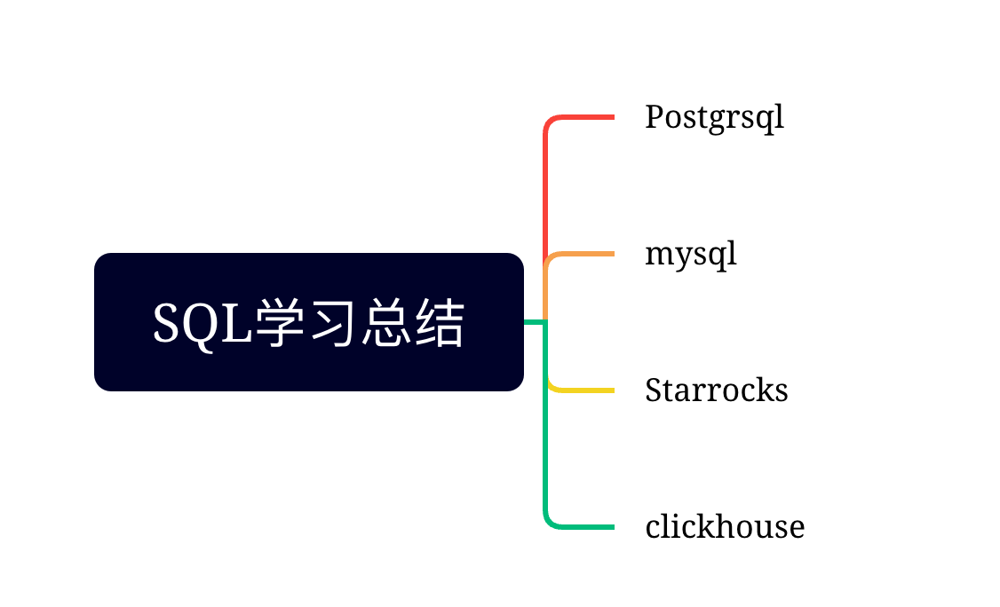

# SQL学习
相关数据库SQL总结




## Postgresql总结

控制台操作命令

|操作|命令|
|----|----|
|设置密码|  \password dbuser| 
|退出控制台| \q|
查看sql命令的解释| \h sql语句
列出所有数据库| \l
进入其他数据库| \c [db_name]
列出当前数据库的所有表| \d
列出某一张表的结果| \d [table_name]
列出所有用户 |\du 
打开文本编辑器| \e 
列出数据库连接信息| \conninfo

查询当前的连接数:
select * from pg_stat_activity;
查看当前最大的连接数 show max_conections;

pgsql 动态复制表
```sql
create table t_key_event_file_student_101 (like t_key_event_file_student);

```
```
create table t_key_event_file_student_100 as select * from t_key_event_file_student;
```
上面两种复制的区别：
like 不会复制数据，并且复制对应字段的约束。
create table as 会复制数据。所有的约束，注释和序列都没有复制成功。


