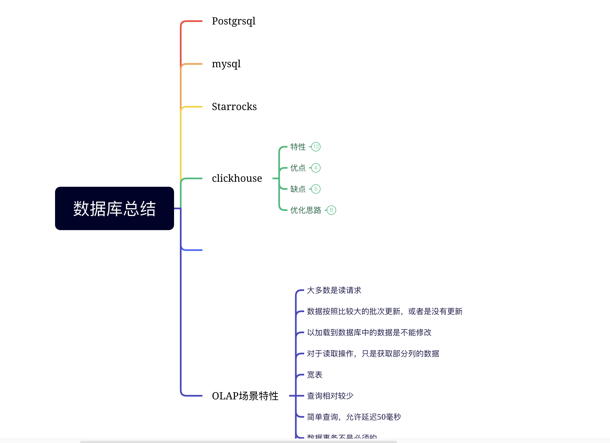

<!--
 * @Author: hashmapybx 15868861416@163.com
 * @Date: 2023-09-12 16:00:43
 * @LastEditors: hashmapybx 15868861416@163.com
 * @LastEditTime: 2024-09-27 18:57:58
 * @FilePath: /SQL-/README.md
 * @Description: 这是默认设置,请设置`customMade`, 打开koroFileHeader查看配置 进行设置: https://github.com/OBKoro1/koro1FileHeader/wiki/%E9%85%8D%E7%BD%AE 
-->
# SQL学习
相关数据库SQL总结


## Postgresql总结

控制台操作命令

|操作|命令|
|----|----|
|设置密码|  \password dbuser| 
|退出控制台| \q|
查看sql命令的解释| \h sql语句
列出所有数据库| \l
进入其他数据库| \c [db_name]
列出当前数据库的所有表| \d
列出某一张表的结果| \d [table_name]
列出所有用户 |\du 
打开文本编辑器| \e 
列出数据库连接信息| \conninfo

查询当前的连接数:
select * from pg_stat_activity;
查看当前最大的连接数 show max_conections;

pgsql 动态复制表
```sql
create table t_key_event_file_student_101 (like t_key_event_file_student);

```
```
create table t_key_event_file_student_100 as select * from t_key_event_file_student;
```
上面两种复制的区别：
like 不会复制数据，并且复制对应字段的约束。
create table as 会复制数据。所有的约束，注释和序列都没有复制成功。

Tchouse 的优化策略


## 列存储和行存储的区别

这篇文章写的很详细：我不在重复轮子了。

https://www.cnblogs.com/xuwc/p/14037950.html

**行存储和列存储最大的区别：**

- 行存储有利于数据的写入，写入性能高，读取性能差，常于OLTP系统
- 列存储有利于数据的读取，写入性能差，适用于现在流行的OLAP系统

## Starrocks 学习

### 表模型

在**明细表**中排序键是Duplicate key 指定的字段，不满足唯一性约束的。

在**聚合表**中排序键是Aggregate key 指定的字段。并且排序键需要满足唯一性约束

在**更新表**排序键是UNIQUe key 指定的字段，并且必须要满足唯一性约束。

在**主键表**中，可以定义主键和排序键，主键primary key需要满足唯一性和非空的约束，主键相同的数据进行REPLACE操作，排序键由ORDER BY指定。


### 明细表

默认的建表类型，在创建表的时候未指定任何key, 则默认都是明细表。

创建表时，支持定义排序键。如果查询的过滤条件包含排序键，则 StarRocks 能够快速地过滤数据，提高查询效率。明细表适用于日志数据分析等场景，**支持追加新数据，不支持修改历史数据**

适用场景：

导入历史数据，不更新历史数据，只会追加新的数据。（日志或者是时序数据）

```sql
CREATE TABLE IF NOT EXISTS detail (
    event_time DATETIME NOT NULL COMMENT "datetime of event",
    event_type INT NOT NULL COMMENT "type of event",
    user_id INT COMMENT "id of user",
    device_code INT COMMENT "device code",
    channel INT COMMENT ""
)
DUPLICATE KEY(event_time, event_type)
DISTRIBUTED BY HASH(user_id)
PROPERTIES (
"replication_num" = "3"
);
```
注意事项：

1、建表的时候没有指定排序键，默认是前面三列。

2、明细表的排序键可以是部分或者全部的维度列。

3、建表时，支持为指标列创建 BITMAP、Bloom Filter 等索引

### 主键表

主键用于标识每一行数据的唯一性，在主键的多个列中，都具有非空唯一性约束。注意事项：

- 在建表时，主键列必须定义在其他列之前。
- 主键必须包含分区列和分桶列。
- 主键列支持的数据类型： 数值（整形和布尔），日期和字符串。
- 单条主键值编码后的最大长度为 128 字节。
- 建表后的主键不能修改。
- 主键列不能更新，避免破坏数据一致性。

```sql
CREATE TABLE orders2 (
    order_id bigint NOT NULL,
    dt date NOT NULL,
    merchant_id int NOT NULL,
    user_id int NOT NULL,
    good_id int NOT NULL,
    good_name string NOT NULL,
    price int NOT NULL,
    cnt int NOT NULL,
    revenue int NOT NULL,
    state tinyint NOT NULL
)
PRIMARY KEY (order_id,dt,merchant_id)
PARTITION BY date_trunc('day', dt)
DISTRIBUTED BY HASH (merchant_id)
ORDER BY (dt,merchant_id)
PROPERTIES (
    "enable_persistent_index" = "true"
);
```

### 聚合表
建表时指定排序键和指标列，在指标列上应用聚合函数（sum,avg等），这样聚合表会减少处理的数据量，提高查询效率。

- 适用场景

分析统计和汇总数据：

1、通过分析网站或 APP 的访问流量，统计用户的访问总时长、访问总次数。

2、广告厂商为广告主提供的广告点击总量、展示总量、消费统计等。

3、通过分析电商的全年交易数据，获得指定季度或者月份中，各类消费人群的爆款商品。

以上场景都是统计数据，不需要查询明细数据，而且历史数据不会更新，只是做追加新数据。

demo: 分析某一个时间段，来自不同城市的用户，访问不同网页的次数。将网页地址`site_id`，日期`date`城市代码`city_code`作为排序键，访问次数`PV`作为指标列，并且指定聚合函数SUM。

```sql
CREATE TABLE IF NOT EXISTS example_db.aggregate_tbl (
    site_id LARGEINT NOT NULL COMMENT "id of site",
    date DATE NOT NULL COMMENT "time of event",
    city_code VARCHAR(20) COMMENT "city_code of user",
    pv BIGINT SUM DEFAULT "0" COMMENT "total page views"
)
AGGREGATE KEY(site_id, date, city_code)
DISTRIBUTED BY HASH(site_id)
PROPERTIES (
"replication_num" = "3"
);
```

注意事项：

1、DISTRIBUTED BY HASH 指定分桶键

2、排序键AGGREGATE KEY 如果没有包含全部维度列（除去指标列外的所有列），那么建表会失败。

3、如果不指定AGGREGATE KEY 。默认是除了指标列外的所有列都是排序键。

4、指标列一般为需要统计汇总的数据。

5、查询时，排序键在多版聚合之前就能进行过滤，而指标列的过滤在多版本聚合之后。因此建议将频繁使用的过滤字段作为排序键，在聚合前就能过滤数据，从而提升查询性能

6、建表时，不支持为指标列创建 BITMAP、Bloom Filter 等索引


## starrocks 参考学习博客

1. https://blog.csdn.net/ult_me?spm=1000.2115.3001.5343